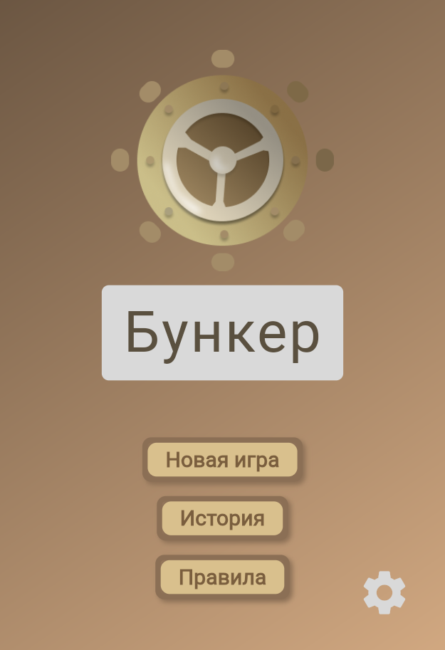
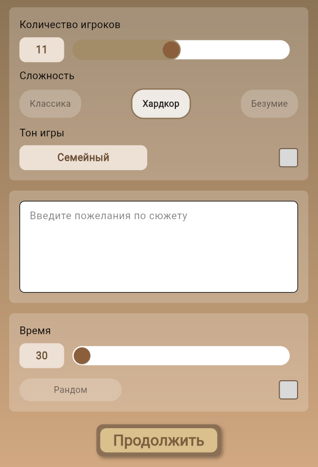
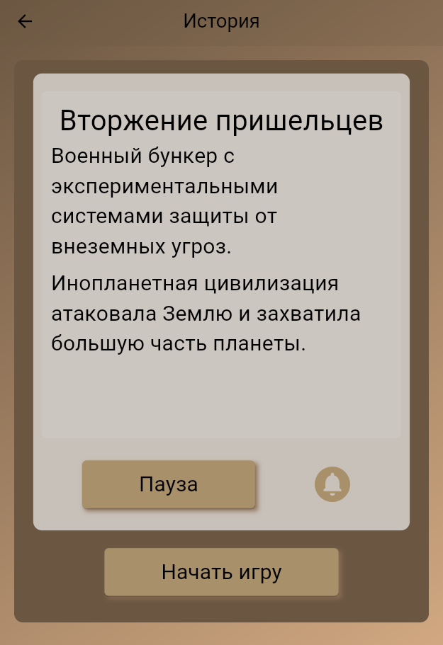
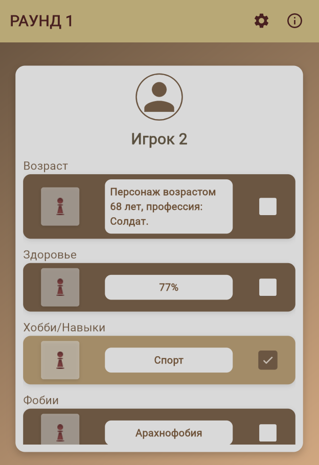

# 🏕 Shelter AI (Бункер AI)

Shelter AI — это усовершенствованная версия популярной настольной игры «Бункер», в которой ключевую
роль играет искусственный интеллект. Теперь каждый игровой сценарий становится уникальным и
полностью динамическим!

---

## 🎮 **Что делает игру особенной?**
✅ **Неограниченные сценарии** – выбирайте или создавайте собственные катастрофы.  
✅ **Живой мир** – AI генерирует персонажей, их характеристики и поведение в реальном времени.  
✅ **Интерактивность** – настройте параметры бункера, запасы и внешнюю среду.  
✅ **Максимальная реиграбельность** – каждая партия уникальна благодаря AI-генерации.

---

## 🚀 **Возможности**
- 🧠 **Генерация игр с помощью ИИ** – каждая партия создается в реальном времени.
- 🎭 **Настройки сюжета** – регулируйте уровень хаоса, включайте семейный режим.
- 🌍 **Мультиплеер** – играйте с друзьями онлайн.
- 📴 **Офлайн-режим** – игра без интернета и VPN.

---

## 📸 **Скриншоты**
   
   

---

## 🔧 **Установка и запуск**
###

1️⃣**Клонирование репозитория**
```sh
git clone https://github.com/Xofty1/ShelterAI.git
cd ShelterAI
```

2️⃣ Установка зависимостей
```sh
flutter pub get
```

3️⃣ Запуск приложения
```sh
flutter run
```

📦 Зависимости
Этот проект использует следующие пакеты:

  🔹   [cupertino_icons](https://pub.dev/packages/cupertino_icons)
  🔹   [flutter_bloc](https://pub.dev/packages/flutter_bloc)
  🔹   [freezed_annotation](https://pub.dev/packages/freezed_annotation)
  🔹   [freezed](https://pub.dev/packages/freezed)
  🔹   [json_annotation](https://pub.dev/packages/json_annotation)
  🔹   [dart_openai](https://pub.dev/packages/dart_openai)
  🔹   [flutter_dotenv](https://pub.dev/packages/flutter_dotenv)
  🔹   [flutter_tts](https://pub.dev/packages/flutter_tts)


📜 Лицензия
Этот проект распространяется под лицензией MIT. Подробнее см. LICENSE.