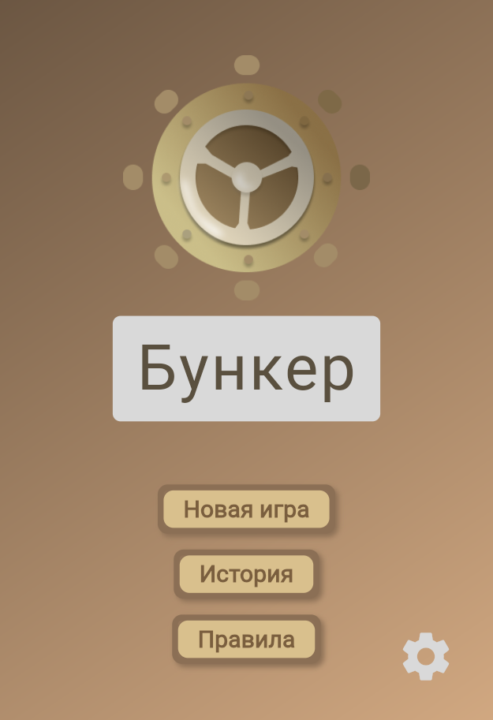
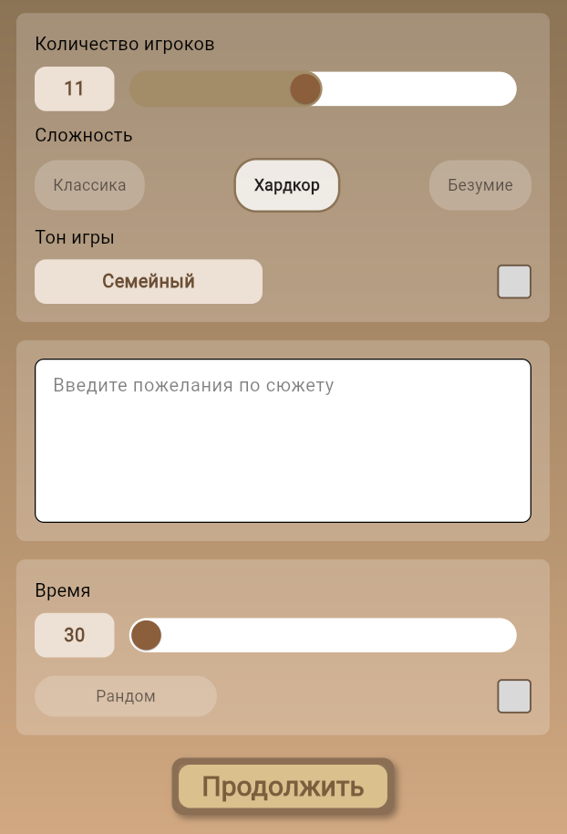
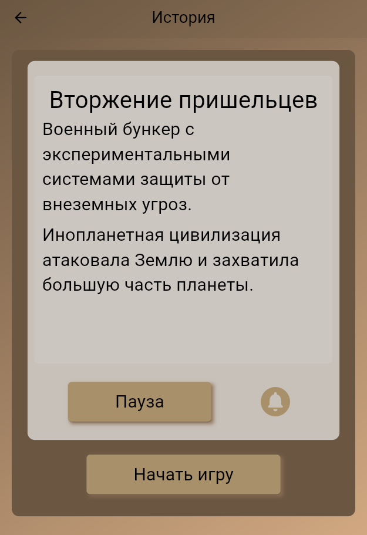
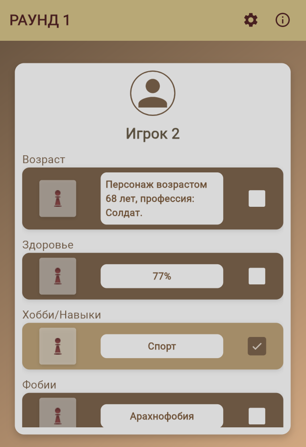

# 🏕 **Shelter AI (Бункер AI)**
> **Игра, в которой AI решает, кто выживет!**

  

Shelter AI — это усовершенствованная версия популярной настольной игры «Бункер», в которой ключевую роль играет искусственный интеллект. Теперь каждый игровой сценарий становится **уникальным** и **полностью динамическим**!

## 🎮 **Что делает игру особенной?**
✅ **Неограниченные сценарии** – выбирайте или создавайте собственные катастрофы.  
✅ **Живой мир** – AI генерирует персонажей, их характеристики и поведение в реальном времени.  
✅ **Интерактивность** – настройте параметры бункера, запасы и внешнюю среду.  
✅ **Максимальная реиграбельность** – каждая партия уникальна благодаря AI-генерации.  

---

## 🚀 **Возможности**
- 🧠 **Генерация игр с помощью ИИ** – каждая партия создается в реальном времени.
- 🎭 **Настройки сюжета** – регулируйте уровень хаоса, включайте семейный режим.
- 🌍 **Мультиплеер** – играйте с друзьями онлайн.
- 📴 **Офлайн-режим** – игра без интернета и VPN.

---

## 📸 **Скриншоты**
<p align="center">
  
  
  
  
</p>

---

## 🔧 **Установка и запуск**

### 1️⃣ **Клонирование репозитория**
```sh
 git clone https://github.com/Xofty1/ShelterAI.git
 cd ShelterAI
```

### 2️⃣ **Установка зависимостей**
```sh
 flutter pub get
```

### 3️⃣ **Запуск приложения**
```sh
 flutter run
```

---

## 📦 **Зависимости**
> **Основные технологии, используемые в проекте**

| Пакет | Описание |
|--------|------------|
|  [cupertino_icons](https://pub.dev/packages/cupertino_icons) | Иконки для iOS-интерфейса |
|  [flutter_bloc](https://pub.dev/packages/flutter_bloc) | Управление состоянием |
|  [freezed_annotation](https://pub.dev/packages/freezed_annotation) | Генерация неизменяемых классов |
|  [freezed](https://pub.dev/packages/freezed) | Поддержка паттерна sealed classes |
|  [json_annotation](https://pub.dev/packages/json_annotation) | Аннотации для JSON сериализации |
|  [dart_openai](https://pub.dev/packages/dart_openai) | Работа с OpenAI API |
|  [flutter_dotenv](https://pub.dev/packages/flutter_dotenv) | Переменные окружения |
|  [flutter_tts](https://pub.dev/packages/flutter_tts) | Текст в речь |

---

## 🛠 **Инструменты для GitHub**
> 🔧 Улучшите работу с репозиторием, используя эти инструменты:

- **[GitHub Actions](https://github.com/features/actions)** – автоматизация CI/CD.
- **[GitHub Pages](https://pages.github.com/)** – развертывание документации.
- **[Shield.io](https://shields.io/)** – красивые бейджики для репозитория.
- **[Renovate](https://github.com/renovatebot/renovate)** – автообновление зависимостей.
- **[Dependabot](https://github.blog/2020-06-01-keep-all-your-packages-up-to-date-with-dependabot/)** – автообновление библиотек.

---

## 📜 **Лицензия**
Этот проект распространяется под лицензией **MIT**. Подробнее см. [LICENSE](LICENSE).

---

<p align="center">
  🚀 <b>Разработано с любовью</b> ❤️ 
</p>
